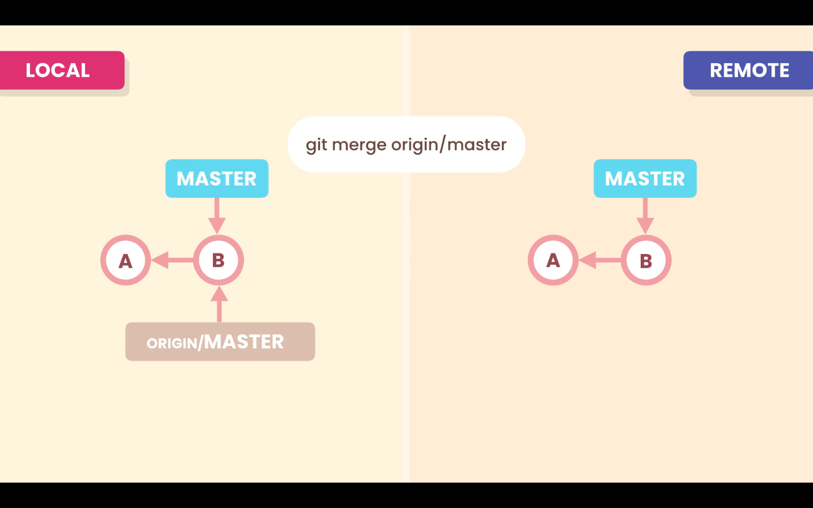

# 06- Fetching

The **Local Repository** and **Remote Repository** work independently. If we have new commits in our **Remote Repository**, because another team member pushed is work, our **Local Repository** will not be aware of it.

We have to use the `git fetch <remote-repository>` command to download the new commits. When we do so the **_`origin/main`_** pointer will move forward, and point to the new commits. But our working directory will not be updated

```zsh
git fetch origin
```

Optionally we can specify a branch to the `fetch` command, like `git fetch <remote-repository> <branch-name>`.

```zsh
git fetch origin bugfix
```


To update our branch with the changes downloaded from the `fetch` command, we have to merge them with our branch, with the command:

```zsh
git merge origin/master
```



## Remote and Local branches

With the command `git branch -vv` we can se how the remote and local branches are diverging.

```zsh
❯ git branch -vv
* main a1929cf [origin/main: ahead 1] lesson complete
```